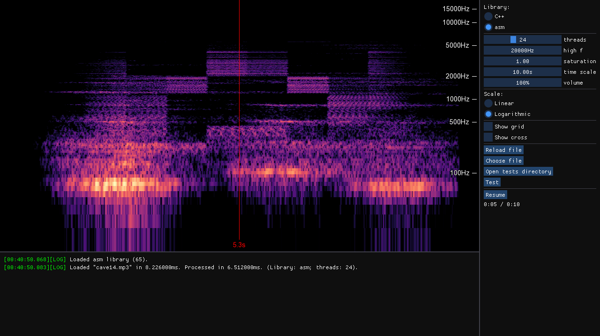

# Spectrogram

An application for visualizing audio spectrograms, created as part of a college assignment. It uses the classic [Cooley-Tukey FFT](https://en.wikipedia.org/wiki/Cooley%E2%80%93Tukey_FFT_algorithm) algorithm and includes two libraries with C++ and x86 assembly implementations of its core component.

The libraries can be freely switched and benchmarked, with results displayed in the console window. When testing performance, the results are also saved to a .csv file.

The [data directory](Spectrogram/data/audio) contains audio files for experimenting with the spectrogram. 

## Features
- Switch between C++ and assembly implementations
- Interactive display
- Adjustable parameters:
    - Thread count (1-64)
    - Frequency range (20-20000Hz)
    - Saturation
    - Time range
    - Frequency scale (Linear or logarithmic)
    - Grid visibility
- Measure performance at the press of a button (see table below)

## Performance

| Threads | C++ [ms] | asm [ms] | Speedup |
|---------|----------|----------|---------|
| 1       | 108.592  | 37.6872  | 2.8814  |
| 2       | 55.1068  | 19.4632  | 2.83133 |
| 4       | 28.7354  | 10.569   | 2.71884 |
| 8       | 16.6056  | 6.516    | 2.54843 |
| 16      | 13.6116  | 5.7954   | 2.34869 |
| 32      | 12.947   | 5.795    | 2.23417 |
| 64      | 11.9754  | 8.8516   | 1.35291 |

Audio file: [cave14.mp3](Spectrogram/data/audio/cave14.mp3). CPU: AMD Ryzen 9 5900X. 

## License
[MIT License](LICENSE)
